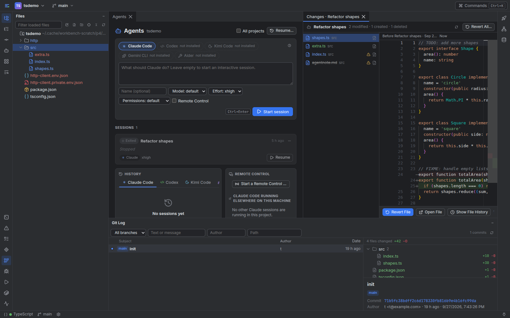
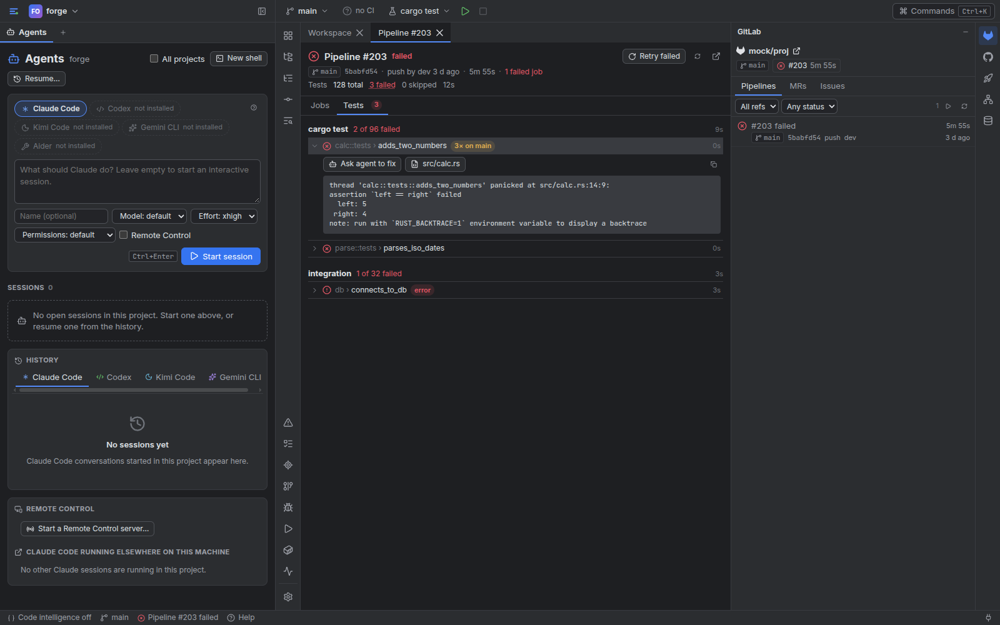

# Workbench

Your agents write the code. You keep the whole project in view.

Workbench puts your coding agents (Claude Code, Codex, Kimi Code, Gemini CLI, Aider or
any CLI you name) in the middle of one window, with everything they touch around them:
the editor, git, merge requests and pipelines, Confluence and Jira, your running apps,
Docker, databases and the reports your agents hand back. It is a single program on your
machine that you open in the browser, on the desktop or from your phone.

**Prerequisite: install and sign in to at least one agent CLI.** Claude Code works out
of the box; Codex, Kimi Code, Gemini CLI and Aider are presets once installed. They are
separate installations, with your own accounts, and are not bundled with Workbench.

- [Install Claude Code](https://code.claude.com/docs/en/setup)
- [Install Codex CLI](https://developers.openai.com/codex/cli)



## Everyday tools

- **Agents at the center.** Sessions and terminals are tabs of a column on the left. Start
  a session from its composer, or with Ctrl+Shift+A on a selection. Answer permission requests from the session card, a toast or your phone.
  Review Changes lists everything a session edited, with Revert per file or for all.
- **Code the CLion way.** A Monaco editor on CLion's keymap, language servers
  (rust-analyzer, typescript-language-server, pyright, gopls, clangd, Verible,
  vhdl_ls…), a debugger for GDB, lldb-dap, CodeLLDB, debugpy and delve, and for
  firmware through OpenOCD, J-Link, pyOCD or QEMU, with the chip's registers by name from
  its SVD file and the target's UART or RTT output ([embedded debugging](docs/embedded-debugging.md)),
  Local History, scratch files and an HTTP client for `.http` files.
- **Version control you can see.** Line staging and partial commits, changelists, the
  shelf, interactive rebase, bisect and a log graph, all without leaving the window.
- **CI and reviews.** GitLab merge requests, pipelines, job logs and failed tests;
  GitHub pull requests, Actions runs and artifacts. A failed job or test goes to an
  agent with one click.
- **Docs and tickets.** Read and write Confluence pages with inline comments,
  attachments and labels; move Jira cards across their boards.
- **Everything that runs.** Run configurations detected from your project files,
  environments with health checks and previews, deploys behind confirmation, dev
  containers, a Services window for Docker and a Database window for PostgreSQL.
- **Deliverables, not scrollback.** Agents hand back reports, images, PDFs and 3D
  models as Workspace cards, shown sandboxed next to the code.
- **In your pocket.** Add Workbench to your phone's home screen. Push notifications
  tell you when an agent needs you, with Allow and Deny on the notification itself.

## Start with an agent

Clone this repository into a folder you control, open it in Claude Code (or another
agent CLI) and paste:

> Set up Workbench on this Linux machine. Read README.md, docs/getting-started.md and
> CLAUDE.md, check the prerequisites, build the web app and the release binary, install
> the binary to ~/.local/bin, and start it with `workbench serve --open`. Use my
> ~/workspace folder for projects. Keep integrations, remote access and push
> notifications off until I ask, and never write a token into a config file: use
> secret references.

## Run on Linux

1. Install a release: download `workbench-<version>-x86_64-unknown-linux-gnu.tar.gz` from
   the [releases](../../releases) (x86_64, glibc 2.35 or newer), then
   ```bash
   tar xzf workbench-*-x86_64-unknown-linux-gnu.tar.gz
   ./workbench-*-x86_64-unknown-linux-gnu/install.sh   # into ~/.local/bin
   ```
2. Or build it yourself, with Rust (1.97 or newer), Node.js 22 and git:
   ```bash
   cd web && npm ci && npm run build && cd ..
   cd server && cargo build --release        # target/release/workbench, the UI embedded
   install -m 0755 target/release/workbench ~/.local/bin/
   ```
   `workbench` is the only binary to install. The build also makes `workbenchw`, the
   Windows launcher of `workbench service`, which on Linux is a stub that only prints a
   message.
3. Start it and open a signed-in window:
   ```bash
   workbench serve --open
   ```
4. Optional: start it with your session, with a desktop launcher:
   ```bash
   workbench service install --enable
   ```

Workbench listens on `127.0.0.1:7777`. The first start writes
`~/.config/workbench/config.toml` from what it finds: every git repository directly
under `~/workspace` becomes a project, and token files such as `~/.gitlab_token` are
picked up as secret references. See [getting started](docs/getting-started.md) for the
whole setup.

## Run on Windows (experimental)

The Windows port is experimental ([status](docs/windows-port.md)): it installs and runs on a
Windows desktop, but not every feature has been exercised there yet. A release that includes
`workbench-<version>-x86_64-pc-windows-msvc.zip` (Windows 10 1809 or newer, or 11; x86_64)
installs from PowerShell:

```powershell
Unblock-File .\workbench-<version>-x86_64-pc-windows-msvc.zip   # removes the Mark of the Web
Expand-Archive .\workbench-<version>-x86_64-pc-windows-msvc.zip -DestinationPath .
powershell -ExecutionPolicy Bypass -File .\workbench-<version>-x86_64-pc-windows-msvc\install.ps1
```

`install.ps1` installs into `%LOCALAPPDATA%\Programs\Workbench` without administrator
rights and adds it to your PATH; then run `workbench serve --open` in a new terminal. The
configuration is `%APPDATA%\workbench\config.toml`, the state `%LOCALAPPDATA%\workbench`.
See [Install on Windows](docs/getting-started.md#install-on-windows-experimental) for what
works differently there.

## Help

The user documentation is also in the app: press **F1**, use the status bar's **Help**,
or open **More → Help** on a phone. It covers getting started, projects, agents, version
control and CI, remote access and the phone app (including Tailscale), running Workbench
as a service, and `config.toml`. The pages are Markdown in `web/src/features/help/pages/`.

## What is inside

| Area | Key | What it does |
| --- | --- | --- |
| **Agents** | Ctrl+Shift+A | A column on the left: the composer, sessions and shells as tabs, history, permission requests, Remote Control |
| **Files** | Alt+1 | The project tree with VCS colours; a Scratches view for notes and requests |
| **Commit** | Alt+0 | Changes, changelists, the shelf and stashes |
| **Git Log** | Alt+9 | Branches, graph and commit details |
| **Run** / **Debug** | Alt+4 / Alt+5 | Run configurations and their output; the debugger |
| **Problems** / **Structure** | Alt+6 / Alt+7 | Diagnostics from language servers; the file's symbols |
| **Services** | Alt+8 | Docker containers, compose projects and images |
| **Terminal** | | Shells under the editor, on the host or in the dev container; shells started from the Agents column are tabs there instead. Alt+F12 collapses the workspace window beside the column |
| **Workspace** | | Deliverable cards: reports, galleries, PDFs, 3D comparisons |
| **GitLab** / **GitHub** | | Merge and pull requests, pipelines and Actions, issues |
| **Confluence** / **Jira** | | Pages, comments and boards |
| **Apps** | | Environments, health, previews and deploys |
| **Database** | | PostgreSQL data sources, schemas and SQL consoles |

Search Everywhere is a double Shift; the command palette is Ctrl+K.

The Workspace's Home starts with four examples:

| Example | What it shows |
| --- | --- |
| **Welcome to Workbench** | Getting started, everyday use and what to change, as Markdown tabs. |
| **A tour of Workbench** | A report with screenshots, and the same screenshots as a gallery. |
| **Hand work to an agent** | What to ask an agent for, its Workspace tools, and a report template to copy. |
| **Connect your services** | A checklist for GitLab, GitHub, Atlassian, Docker, databases and the phone. |

The examples stay visible until you archive them. Create your own cards next to them, or
archive all four when you are ready.



## Where your data stays

Workbench runs on your machine and talks only to the services you connect. Tokens stay
where they already are: `config.toml` holds *references* (a file, an environment
variable, a `.env` key, the keyring or a command) and the values never reach the
browser, logs or command lines. A repository's own `.workbench.toml` is treated as
untrusted: it cannot define secrets, loosen an agent's permissions or run anything by
itself. Agents reach Workbench through MCP tools confined to their own project.

Read [security and privacy](docs/security.md) before you open Workbench to other
devices.

## Make it yours

Settings covers the theme, the editor keymap, agents, integrations, secrets, remote
access and notifications. Per project, Workbench detects run configurations from Cargo,
package.json, Python, Go, CMake, Gradle, Maven, Make, compose files, Unity, .NET and
more; you add or override them in `.workbench.toml` or a machine-local overlay. See
[customization](docs/customization.md), [working with agents](docs/agents.md),
[embedded debugging](docs/embedded-debugging.md),
[your phone and remote access](docs/remote-access.md) and the
[keyboard shortcuts](docs/keyboard-shortcuts.md).

Developed and tested on Linux (x86_64). The UI runs in any current browser, phones
included. A Windows port of the server is experimental: it installs and runs on a
Windows desktop, but not every feature has been exercised there yet
([status](docs/windows-port.md)). macOS is not supported.

For how it is built (the slices, contracts, events and the full security model), read
[the architecture](docs/ARCHITECTURE.md). To work on Workbench itself, open the
repository in its dev container (`.devcontainer/`).

Workbench is under the MIT license. Its Workspace feature adapts code from
[Mr. Mak Workspace](https://github.com/witnesstodark/mr-mak-workspace) (MIT); see
[third-party notices](THIRD_PARTY_NOTICES.md).
