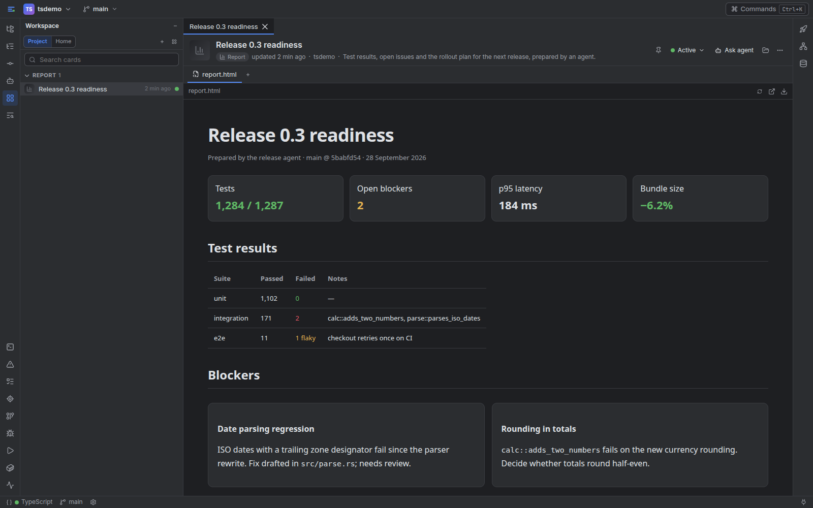

# Working with agents

Workbench runs your agent CLIs as they are: real sessions in real terminals, with your
own accounts and your own settings. What it adds is everything around them.

## Start a session

The **Agents** column on the left opens on a prompt (Ctrl+Shift+A shows it as a dialog
from anywhere). Pick a provider, type a task (or nothing, for an interactive session) and
start. Sessions, shells and run output are tabs of that column; they follow the
**Agents** button left to right and wrap onto as many rows as they need. **+**, after the
last tab, starts another session or a shell, and closing a tab stops what runs in it (a
session stays in the history and can be resumed). The top bar of the agents window says
how many sessions are working or need you; click it to go to the next one that waits. Options: a name, the model, the
effort, the permission mode, Claude Code's Remote Control, and, when the project has a
running dev container, **Run in dev container**.

You also start sessions from where the work is:

- **Ask Agent About Selection** in the editor (Ctrl+Shift+A with a selection).
- **Ask agent to fix** on a failed GitLab job, a failed test in a pipeline, or a failed
  GitHub job; the prompt carries the log or the test's output.
- **Ask agent about this stop** in the debugger.
- **Ask agent** on a Workspace card.

A prompt goes to the project's most recently active session that can take it, or starts
a new one. Sessions survive a Workbench restart, and Claude Code's history lets you resume
earlier conversations.

## Permission requests

When a Claude Code session asks to run a command or edit a file, the request appears on
its card, its tab, as a toast, and on your phone, with **Allow**, **For session** and
**Deny**. The prompt in the terminal keeps working too; whichever answer comes first wins.
Only signed-in devices can answer: a session can never approve itself through Workbench.
`[agents] answer_permissions = false` turns this off; `permission_wait` sets how long a
request waits.

## Review Changes

Workbench's Local History records every file a Claude Code session writes, attributed to
that session. **Review Changes** (a session's menu) lists them: each file's version from
before the session against the file now, with **Revert File**, **Delete File** for files
it created, **Restore File** for files it deleted, and **Revert All**. Changes made by
other people since are flagged before you revert.

## What agents can do in Workbench

Claude Code and Codex sessions get Workbench's MCP server, with tools grouped by what
they touch. Every tool is confined to the session's own project.

| Tools | What they are for |
| --- | --- |
| `workbench_*` | Open a file, a diff, Markdown or a URL in your window; notify you; list sessions and read their output; propose a commit message; read changelists |
| `gitlab_*`, `github_*` | Pipelines and runs, job logs, failed tests, merge and pull requests with their diffs; comments, retries and new MRs/PRs |
| `confluence_*`, `jira_*` | Search, read and write pages, comments, attachments and labels; issues, transitions and boards |
| `workspace_*` | Create Workspace cards and add their steps: the way an agent hands you a report |
| `run_*`, `env_status` | Start and read run configurations; environment health |
| `code_*`, `debug_state`, `files_local_history` | Diagnostics and symbols from running language servers; a paused debugger's state; Local History |
| `devcontainer_status` | Whether the dev container runs |

Tools never deploy, never run destructive git operations, never start a language server
or debugger, and never answer a permission request. Run configurations that deploy or
release are refused to agents; you start them.

## Workspace cards

A Workspace card is a deliverable with tabs: a report, a gallery of images, a PDF, a 3D
comparison, a Markdown note. Agents create them with the `workspace_*` tools; you see them
in the Workspace tool window, pinned or by freshness, and open them next to the code.



Reports are HTML files served sandboxed: they cannot read Workbench's cookies or storage,
reach the page around them, or call its API. Reports that link `../_shared/report.css`
and `../_shared/report.js` and set `data-wb-report="document"` on `<html>` get the
standard dark look and a click-to-zoom image lightbox. The **Hand work to an agent**
example in Home has prompts to try and a report template that uses all of it. A
repository with a `workspace/workspace.json` in Mr. Mak Workspace's format shows those
cards too.

## Other agent CLIs

Codex, Kimi Code, Gemini CLI and Aider are presets: install one and it appears in the
composer. Any other CLI is a `[agents.providers.<name>]` entry with its `command`. Codex
sessions get the MCP tools and their state from Codex's own session log; Kimi Code, Gemini
CLI, Aider and custom CLIs run without the MCP tools (their MCP settings live in files
Workbench does not change) and show activity from their output. Permission requests
answered from Workbench and Review Changes are Claude Code's.

## More than one account

A second subscription of Claude Code, Codex, Kimi Code or Gemini CLI is an **account**: the
same CLI with its own login, history and settings in a folder of its own. Aider has no login,
so its account is its own `.env` file of API keys. Manage them in **Settings → Agents →
Accounts** (or with the **Account** button beside the CLIs in the new session composer): a
name, a label and the folder, such as `~/.claude-work`. An account appears in the picker
beside the CLI as "Claude · Work", and its sessions carry that name. The first session
started with it shows the CLI's own sign-in, because the folder holds no login yet.

Behind the form this is `[agents.providers.claude-work]` with `kind = "claude"` and
`env = { CLAUDE_CONFIG_DIR = "~/.claude-work" }`. The variable is `CODEX_HOME` for Codex,
`KIMI_CODE_HOME` for Kimi Code, `GEMINI_CLI_HOME` for Gemini CLI (the folder that holds its
`.gemini`) and `AIDER_ENV_FILE` for Aider. Model, effort and extra arguments can be set per
account in `config.toml`, which stays the place to edit by hand (Settings → Raw config).
Conversation history, Remote Control links and the live sessions listed on Home follow each
session's account. Workbench never reads or copies a login or a key. An Aider account's file
must exist before a session starts (Aider would otherwise run on the default keys without
saying so); Aider keeps its chat history in each repository, shared by all its accounts.

## Local models

Claude Code, Codex and Aider can run on a model of your own: **Settings → Agents → Accounts → Add
local model** takes the server (Ollama, LM Studio, or any OpenAI- or Anthropic-compatible one such as
llama.cpp's `llama-server` or vLLM), its address and a model, and **Find models** lists what the server
serves. Sessions of that account talk only to your server: nothing of the vendor's login or API key is
passed on, and a session does not start at all if the server's setup is incomplete, instead of reaching
the vendor. Claude Code needs a server with the Anthropic Messages API (Ollama 0.14+, LM Studio 0.4.1+,
llama.cpp, vLLM, or a gateway); Codex needs `/v1/responses` (Ollama 0.13.4+, LM Studio 0.3.29+); Ollama
recommends a context of 64k or more for both. Local sessions have no Remote Control and no usage limits.

Set the model's **context window** (64k or more; Claude Code's own instructions and tools fill a small
one, and at 32k it compacted the conversation at once in a test) and give the server the same
(`OLLAMA_CONTEXT_LENGTH`; Ollama starts at 4096 and cuts off what does not fit).

**DeepSeek and other open models.** Any model your server serves can be named, so DeepSeek, Qwen,
GLM, Kimi, gpt-oss or Devstral run as long as the server can make **tool calls** with them, which an
agent needs (Aider does not). On Ollama that is a capability a model has or has not, shown by
`ollama show <model>`: from its source and third-party listings, `qwen3-coder`, `gpt-oss`, `glm-4.6`,
`kimi-k2`, `devstral` and `deepseek-v3.1`/`v3.2` have it, recent pulls of `deepseek-r1` do (small
ones work poorly for agents), `deepseek-v3` and `deepseek-coder-v2` do not. llama.cpp needs `--jinja`;
vLLM needs `--enable-auto-tool-choice` and a `--tool-call-parser` for the model (`deepseek_v3` for
DeepSeek), and a served model name without `/`. **Hosted** APIs such as DeepSeek's own
(`https://api.deepseek.com/anthropic`), OpenRouter, Z.ai, Moonshot or Fireworks are not supported
yet: they need an API key, and Workbench keeps no key in an account's settings.

```toml
[agents.providers.claude-local]
kind = "claude"
model = "qwen3-coder:30b"
env = { CLAUDE_CONFIG_DIR = "~/.claude-local" }   # its own sessions and history
local = { server = "ollama" }                     # url defaults to http://localhost:11434
```

## Usage limits and failover

Workbench shows how full each account is and, when one is at its limit, can use the next. It learns
the usage from what the CLIs report about themselves (Claude Code's status line, Codex's session log,
and the message a CLI prints when it refuses a turn); it asks no vendor and reads no login. Give an
account a `fallback` list, in Settings (**Edit**, or the built-in Claude Code row) or in `config.toml`:

```toml
[agents]
failover = "new"                  # "off", "new" (default) or "session"

[agents.providers.claude]         # the default login
fallback = ["claude-work", "claude-local"]
```

With `new`, a session you start (or an agent starts) skips an account that is at its limit and runs on
the first one of the list that is not, and says so. With `session`, a running session that hits its limit
also continues on the next account: a new session in the same folder, told what the old one was doing and
where its conversation is; the old one is left as it is. Without `session`, the toast of a session
that hit its limit offers **Continue on …**. If the CLIs' reports are wrong or not enough, mark an account
at its limit or usable by hand in its **Edit** dialog.

## Moving a conversation to another account

**Continue on another account…** in a session's menu (or the toast of a session that hit its limit, or
`failover = "session"`) starts a new session in the same folder on the account you pick. What it carries
depends on the two CLIs:

- **The same CLI** (Claude Code to another Claude Code account, Codex to Codex, also onto a local
  model): the conversation itself. Workbench copies the session's own file into the other account's
  folder and resumes it, so the model sees the whole history, tool calls included. No login is read or
  copied, only the conversation file.
- **A different CLI** (Claude Code or Codex to Codex, Aider, Kimi…): what was said, as text. The user's
  and the assistant's words and one line per tool call, without tool output, are written to a Markdown
  file the new session reads first (short conversations go in its prompt). The first turn and the most
  recent ones are kept when it is long. The conversation goes to that CLI's service, or stays on your
  network for a local model.
- **Otherwise** (Kimi, Gemini, Aider or a custom CLI as the source, or **Only a short note** chosen):
  a note on where the old session stopped.

The old session is left as it is. `[agents] transfer = "notes"` makes the note the default.

## On Windows

Windows support is in progress ([windows-port.md](windows-port.md)); this is how agents and
terminals behave there.

- Terminals run PowerShell 7 (`pwsh`) when it is installed, else Windows PowerShell. Set
  `[terminals] shell` in `config.toml` for another shell, such as Git Bash's `bash.exe`.
- Claude Code's native `claude.exe` in `%USERPROFILE%\.local\bin` (where its installer puts
  it) is used before the npm package's `claude.cmd`. CLIs installed with npm (Codex, Gemini
  CLI and others) start as `node` and their script, never through cmd.exe.
- A CLI that is a batch file of its own (`.bat` or `.cmd`, not an npm shim) gets its first
  prompt pasted instead of passed on the command line when the prompt holds
  `% ! ^ & | < > "` or a line break, which cmd.exe would read as its own. It does not start
  when another of its arguments or its own path holds one.
- A cmd.exe among an agent's processes (a batch-file CLI's own, or one the agent starts)
  never runs a program from the project folder by a bare name
  (`NoDefaultCurrentDirectoryInExePath`). A terminal's shell keeps Windows' usual lookup,
  since you type its commands.
- Killing or closing a terminal ends every process started in it, programs with windows
  included. Only a program that asks to leave the terminal's job keeps running, as the
  service that `workbench service install --enable` starts does.
