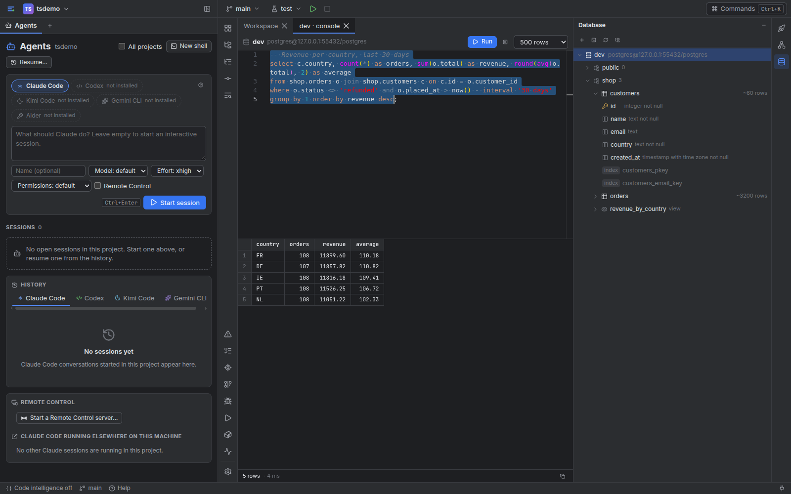

# Make Workbench yours

## Change in Settings

Settings (Ctrl+,) covers the everyday choices, and saves them into
`~/.config/workbench/config.toml` without disturbing its comments or layout:

- **General:** theme, editor font size, Markdown opening as a page or as source, and the
  editor keymap (CLion by default, or VS Code's).
- **Projects:** which folders are projects, and each project's configuration layers.
- **Agents:** providers, the default model and effort, and how permission requests are
  answered.
- **Integrations:** GitLab, GitHub (or GitHub Enterprise) and Atlassian.
- **Secrets:** every secret reference, whether it resolves, and a fix for token files
  others can read.
- **Remote access** and **Notifications:** see [remote access](remote-access.md).
- **Raw config:** the whole file, validated before it is saved.

## Keep secrets where they are

Config files hold *references*, never values:

```toml
[secrets]
gitlab    = { file = "~/.gitlab_token" }
github    = { env = "GITHUB_TOKEN" }
atlassian = { keyring = "workbench/atlassian" }
db_url    = { dotenv = { path = "app/.env", key = "DATABASE_URL" } }
staging   = { command = ["pass", "show", "shop/staging"] }
```

Values are read by the server when needed. They never reach the browser, a command line
or a log, and terminal output that contains one is masked.

On Windows (experimental), `~` is your user folder (`%USERPROFILE%`), `config.toml` and the
overlays are in `%APPDATA%\workbench`, and a `keyring` reference reads Windows Credential
Manager: `workbench/atlassian` is the generic credential named `atlassian.workbench`.

Write Windows paths in these files as `~/...`, with forward slashes, or in single quotes.
In double quotes a backslash starts an escape, so `"C:\Users\me\token"` does not parse:

```toml
[secrets]
gitlab = { file = "~/.gitlab_token" }
github = { file = "C:/Users/me/tokens/github" }
db_url = { dotenv = { path = 'C:\Users\me\shop\.env', key = "DATABASE_URL" } }
```

A machine overlay that does not parse is left out whole, secrets included, until you fix
it. Settings › Projects shows its error, and so does anything that needs one of its
secrets.

## Configure a project

Workbench detects a project's run configurations and environments from its files. You
change the result in two layers, merged by name over what was detected:

| Layer | Where | Committed? | Can hold secrets? |
| --- | --- | --- | --- |
| Detected | computed from the repository | — | no |
| Repository | `.workbench.toml` in the project root | yes, share it with your team | no, and it cannot loosen an agent's permissions or run anything by itself |
| Machine overlay | `~/.config/workbench/projects/<id>.toml` | no | yes: `[secrets]`, hosts, deploys |

A few examples:

```toml
[[run]]
name = "api"
kind = "server"                  # server, task, test, build, service or editor
command = "cargo run -p api"
cwd = "server"
port = 8080
ready = { http = "http://127.0.0.1:8080/health" }
env = { DATABASE_URL = "${secret:db_url}" }

[[env]]
name = "staging"
kind = "staging"
url = "https://staging.example.com"
health = { url = "https://staging.example.com/api/health", interval_s = 60 }
logs = [{ name = "api", command = "docker logs -f --tail 300 shop-api-1" }]
deploy = { command = "./deploy.sh {sha8}", confirm = "typed" }

[[database]]
name = "dev"
host = "localhost"
database = "shop"
user = "shop"
password = "db_password"         # the name of a [secrets] entry

[[debug]]
name = "api (gdb)"
adapter = "gdb"
program = "target/debug/api"
pre_launch = "cargo build -p api"
```

An environment with a `host` runs its logs, commands and deploys over ssh on that host;
deploys always ask first (`confirm = "click"` or `"typed"`) and can require a green
pipeline.

## Databases

The Database window (right stripe) connects to PostgreSQL. **Add Data Source** asks for
the host, database and user, and for the *name* of the secret holding the password, or of
one holding a whole connection URL such as your `.env`'s `DATABASE_URL`. Without either,
`~/.pgpass` is used, as psql would. Each console keeps its own session, so `BEGIN` and
`SET` last across runs; Ctrl+Enter runs the statement at the caret. Mark a source
read-only to start its sessions in read-only transactions.



## Tools on your machine

`config.toml` is the only place that names programs Workbench may start:

```toml
[agents.providers.codex-work]      # a second Codex with its own home
kind = "codex"
env = { CODEX_HOME = "~/.codex-work" }

[agents.providers.my-agent]        # any other CLI
command = "~/bin/my-agent"
label = "My agent"

[lsp.servers.rust-analyzer]
command = "~/.cargo/bin/rust-analyzer"

[debug.adapters.lldb-dap]
command = "/usr/bin/lldb-dap"

[devcontainer]
docker = "docker"                  # or podman's docker-compatible CLI
cli = ""                           # devcontainer CLI, for configs with features

[terminals]
shell = ["/bin/zsh", "-l"]         # new shells (default: $SHELL -l; PowerShell on Windows)
```

Language servers and debug adapters run project code, so they start only after you
enable code intelligence for a project (its first source file offers it) or press Debug.

On Windows (experimental) run commands go to PowerShell, and detected ones are
written for it: `python` or `py -3` and the virtualenv's `Scripts\python.exe`,
`.\gradlew.bat`, CMake's Debug folder (`.\build\Debug\app.exe`; with Ninja, set
`CMAKE_GENERATOR` or configure once and detection follows), `curl.exe`, `$env:PORT`, no
`&&` (Windows PowerShell 5.1 has none). Commands from a Procfile or a README that need a
POSIX shell, `validate.sh` scripts, and scripts or tasks whose names hold `% ! ^ & | < > "`
(batch files would misread them) are not offered: add them to `.workbench.toml` in
PowerShell's syntax. Runs get Workbench's own `PATH`: start Workbench after installing a
tool, or add the tool's folder to your `PATH`. Language servers installed with `npm install -g` are found in
`%APPDATA%\npm` and run with Node directly. GDB reads only MinGW builds: to debug Rust
built with the default MSVC toolchain, install lldb-dap or CodeLLDB and name the one you
installed as Rust's adapter (CodeLLDB's `codelldb` has to be on `PATH`, or set
`[debug.adapters.codelldb] command`):

```toml
[debug.default_adapter]
rust = "lldb-dap"                  # or "codelldb"
```

## Change with an agent

| Ask for | Where it belongs |
| --- | --- |
| “Add a run configuration for the worker.” | `[[run]]` in `.workbench.toml` |
| “Watch staging's health and let me deploy it.” | `[[env]]` in the machine overlay (it names hosts and secrets) |
| “Connect the dev database.” | Database › Add Data Source, or `[[database]]` with a secret name |
| “Use my own build of rust-analyzer.” | `[lsp.servers.rust-analyzer]` in `config.toml` |
| “Write up what you found.” | A Workspace card (the agent's MCP tools create it) |
| “Keep this snippet around.” | A scratch file (Ctrl+Alt+Shift+Insert) |

A useful instruction: “Read the project's `.workbench.toml` and the detected
configuration in Settings › Projects, propose the smallest change, make it, and check that
the run starts.”

## Dev containers

A project with a `devcontainer.json` gets a **Dev container** chip in the top bar. Its
panel shows what the configuration would run, the dangerous parts first (privileged mode,
the host network, the Docker socket, host paths). Nothing is built or started until you
approve that exact plan, and any change to the config, its Dockerfile or compose files asks
again. Once it runs, new shells, run configurations and (if you choose) agent sessions run
inside it, while the files stay on your machine.
