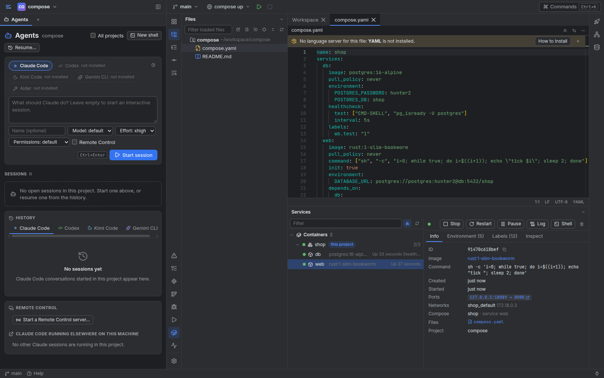

# Getting started

Workbench is one program that runs on your machine and serves its UI to your browser.
Your projects stay ordinary folders, your agents stay ordinary CLI sessions, and your
tokens stay in the files and keyrings where you already keep them. You can stop using
Workbench at any time and nothing about your projects changes.

**Required: at least one agent CLI, installed and signed in with your own account.**
Claude Code is the one Workbench integrates most closely (permission requests, Review
Changes, the MCP tools); Codex, Kimi Code, Gemini CLI and Aider are presets, and any other
CLI can be added in `config.toml`.

## What you need

- Linux on x86_64 (glibc 2.35 or newer for the release binaries, e.g. Ubuntu 22.04,
  Debian 12, Fedora 36). Workbench is developed and tested there. Windows 10 (version
  1809 or newer) and 11 on x86_64 are experimental: see
  [Install on Windows](#install-on-windows-experimental).
- git. To build from source: [Rust](https://rustup.rs) 1.97 or newer and
  [Node.js](https://nodejs.org) 22.
- Optional, for the features that use them: Docker (dev containers and Services),
  language servers (code intelligence), GDB / lldb-dap / debugpy / delve (debugging).

## Install a release

Download `workbench-<version>-x86_64-unknown-linux-gnu.tar.gz` from the repository's
releases, check it against its `.sha256` file if you like, and run its installer:

```bash
sha256sum -c workbench-*-x86_64-unknown-linux-gnu.tar.gz.sha256
tar xzf workbench-*-x86_64-unknown-linux-gnu.tar.gz
./workbench-*-x86_64-unknown-linux-gnu/install.sh
```

`install.sh` copies the binary to `~/.local/bin/workbench` (`PREFIX=/usr/local` for
`/usr/local/bin`, with the rights to write there) and tells you when that folder is not on
your PATH or when a running service needs a restart.

## Build and install from source

```bash
git clone <your copy of this repository> ~/src/workbench
cd ~/src/workbench
cd web && npm ci && npm run build && cd ..
cd server && cargo build --release
install -m 0755 target/release/workbench ~/.local/bin/
```

The web UI is embedded in the binary, so `~/.local/bin/workbench` is all you need to run.
The build also makes `target/release/workbenchw`, the Windows launcher of `workbench
service`: on Linux it is a stub that only prints a message, and nothing uses it. To update
later, install the new release (or pull, rebuild both parts and install the
binary again); then restart the service (below) or the running `workbench serve`.

## Install on Windows (experimental)

The Windows port is in progress ([status](windows-port.md)). It has not been tested on a
real Windows machine yet, and some features are left out (below). It needs Windows 10
version 1809 or newer, or Windows 11, on x86_64.

A release that includes `workbench-<version>-x86_64-pc-windows-msvc.zip` installs from
PowerShell, in the folder you downloaded it to (put the release's version in the names):

```powershell
(Get-FileHash .\workbench-<version>-x86_64-pc-windows-msvc.zip).Hash   # compare with the .sha256 file
Unblock-File .\workbench-<version>-x86_64-pc-windows-msvc.zip
Expand-Archive .\workbench-<version>-x86_64-pc-windows-msvc.zip -DestinationPath .
powershell -ExecutionPolicy Bypass -File .\workbench-<version>-x86_64-pc-windows-msvc\install.ps1
```

- `Unblock-File` removes the Mark of the Web that Windows puts on downloads, so the
  unpacked files do not carry it. Windows PowerShell runs no scripts under its default
  policy, and under RemoteSigned none downloaded unsigned: `-ExecutionPolicy Bypass` allows
  `install.ps1` for this one run.
- `install.ps1` copies `workbench.exe`, `workbenchw.exe` (it starts Workbench from the Start
  Menu and at sign-in: [Run it as a service](#run-it-as-a-service)), `conpty.dll` and
  `OpenConsole.exe` (the console host its terminals use) and the documents to
  `%LOCALAPPDATA%\Programs\Workbench` without administrator rights, and adds that folder to
  your user PATH. `-Prefix <folder>` installs elsewhere. A folder it creates admits only you,
  SYSTEM and Administrators; it warns when an existing one lets other accounts change it,
  since they could then replace the programs you start from it.
- Installing over a running Workbench works: Windows cannot replace a running program, so
  its files are renamed aside (`*.old`, removed by the next install). Restart Workbench to
  use the new version.

Open a new terminal (it gets the new PATH) and start Workbench as on Linux:

```powershell
workbench serve --open
```

Where things are on Windows (`WORKBENCH_CONFIG_DIR` and `WORKBENCH_DATA_DIR` still override
both folders):

| What | Where |
| --- | --- |
| `config.toml` and the project overlays (`projects\<id>.toml`) | `%APPDATA%\workbench` |
| Workbench's state: token, sessions, Local History, Workspace cards | `%LOCALAPPDATA%\workbench`, readable only by you and SYSTEM |
| `~` in the configuration | your user folder, `%USERPROFILE%` |
| Projects found on the first start | git repositories directly under `%USERPROFILE%\workspace` |
| Token files found on the first start | `.gitlab_token`, `.github_token`, `.atlassian_token` in `%USERPROFILE%` |

To remove Workbench, stop it (`workbench service stop`, or Ctrl+C where `workbench serve`
runs), then run the installer with `-Uninstall` from a terminal outside Workbench (add the
`-Prefix` you installed with, if any):

```powershell
powershell -ExecutionPolicy Bypass -File .\workbench-<version>-x86_64-pc-windows-msvc\install.ps1 -Uninstall
```

It runs `workbench service uninstall` for each service whose sign-in entry or Start Menu
shortcut starts the programs in `%LOCALAPPDATA%\Programs\Workbench` (a service of Workbench
in another folder stays), deletes the files `install.ps1` put in that folder, removes the
folder from your user PATH, then deletes the folder once nothing else is in it. While a
program from the folder runs, or when it cannot tell, it changes nothing and says why. Your
configuration and Workbench's state (the two folders above) stay for a later install; delete
them to remove those too. By hand, the same is:

1. `workbench service stop`, then `workbench service uninstall` (with `--name <name>` for a
   service installed under a name).
2. Delete `%LOCALAPPDATA%\Programs\Workbench`.
3. Remove that folder from `Path` in your user variables (search the Start menu for *Edit
   environment variables for your account*), then open a new terminal.

Good to know:

- Terminals start PowerShell 7 (`pwsh`) when it is installed, else Windows PowerShell.
  Run configurations, pre-launch steps and the notify command run through the same
  PowerShell, so a command written for bash needs a PowerShell form (Windows PowerShell 5.1
  has no `&&`: install PowerShell 7).
- Version control needs [Git for Windows](https://git-scm.com/download/win).
- Installers put their programs on PATH for programs started afterwards. Workbench's new
  terminals, runs and agent sessions get the PATH a new sign-in gets, and its own lookups
  (language servers, debug adapters, agent CLIs) try it too and pass its folders on to what
  they start, so Node.js, Python or rustup installed while it runs are found at once. The
  Git features find Git for Windows only once Workbench restarts (`workbench service stop`,
  then Workbench from the Start Menu, or `workbench serve` in a new terminal).
- A `keyring` secret reference reads Windows Credential Manager: `{ keyring =
  "workbench/atlassian" }` is the generic credential named `atlassian.workbench`.
- The binaries are not code-signed, so SmartScreen or an antivirus may warn about
  `workbench.exe`, a program that starts terminals and other programs. Windows 11's Smart
  App Control blocks unsigned programs outright, with no exception per program: with it on,
  `install.ps1` fails when it runs `workbench.exe --version`. Turn it off (Windows Security ›
  App & browser control) or wait for signed releases.
- Binding an address other than loopback (remote access) makes Windows Firewall ask whether
  to allow it.
- The folders that contain an open project cannot be renamed or moved while Workbench runs
  (as with any IDE that watches them); folders inside the project can. Names that differ
  only in case are one file: creating `A.txt` next to `a.txt` reports that it exists, and
  renaming `a.txt` to `A.txt` changes only the case.
- Creating a symbolic link (copying a folder that holds one) needs Developer Mode or an
  administrator; without it the copy fails with a message saying so.
- The programs a terminal starts end when that terminal is closed, restarted or killed, or
  when Workbench stops, and that includes a browser or an editor that a program in the
  terminal opens when it was not running yet (the sign-in page of an agent CLI, `code .`):
  all of its windows close with the terminal. Start your browser and editor outside
  Workbench first; one that already runs only receives the page or folder. On Linux such
  programs usually outlive the terminal.

The first version leaves a few things out; where one of them is asked for, Workbench says
"Not available on Windows" and why:

- **Dev containers.** Their chip, status item and commands are not shown. The **Services**
  window (Docker containers, compose projects, images) works with Docker Desktop but is
  marked *experimental*: it has not been tested there yet. To get dev containers, run the
  Linux build inside WSL 2 with Docker Engine installed in the same distribution: see
  [The Linux build inside WSL](#the-linux-build-inside-wsl).
- **Desktop notifications** from the server. Turn on browser notifications
  (Settings › General), which then also notify on the computer Workbench runs on, or push.
- **gdb attaching to a running process**, and rust-gdb's pretty printers. Attach to
  Process… uses lldb-dap or CodeLLDB for native programs and debugpy for Python.
- **Projects on a network share or inside WSL** (`\\server\share`, `\\wsl$\…`, and a mapped
  network drive such as `H:`, which is a share too). Clone the repository to a local drive,
  or run the Linux Workbench inside WSL for those projects
  ([The Linux build inside WSL](#the-linux-build-inside-wsl)).

Building from source on Windows needs Rust with the MSVC toolchain (the Visual Studio Build
Tools' C++ workload) and Node.js 22. In PowerShell, from the repository (build in `server`,
where `.cargo\config.toml` links the C runtime statically):

```powershell
cd web; npm ci; npm run build; cd ..\server
cargo build --release
```

Copy `workbench.exe` and `workbenchw.exe` from `server\target\release` to a folder only you
can change, and put `conpty.dll` (`runtimes\win-x64\native`) and `OpenConsole.exe`
(`build\native\runtimes\x64`) from the
[Microsoft.Windows.Console.ConPTY](https://www.nuget.org/packages/Microsoft.Windows.Console.ConPTY)
package (a `.nupkg` is a zip) next to them; the release archives use version 1.24.260710001.
Workbench loads `conpty.dll` only from its own folder or System32, never from the folder you
start it in. Without the two files, terminals use the console host built into Windows, which
renders less well on Windows 10.

### The Linux build inside WSL

Inside a WSL 2 distribution, install the Linux release as on Linux
([Install a release](#install-a-release)). It is the Linux program there: dev containers are
offered, and its projects are the distribution's own folders (`~/workspace` in the
distribution), the ones the Windows build refuses as `\\wsl$\…` paths. WSL 2 forwards ports
that listen on the distribution's loopback to Windows by default, so a browser on Windows
can open the link `workbench url` prints.

What decides whether dev containers work there is where the Docker engine runs. A Claude
Code session inside a container reaches Workbench through a listener on the container
network's gateway (usually `172.17.0.1` on Docker's default network), so that address has
to belong to the distribution Workbench runs in.

- **Docker Engine installed in the same distribution:** the engine's networks are set up
  in that distribution, so the gateway is one of its addresses and Workbench listens there
  as it does on Linux.
- **Docker Desktop's WSL integration:** the engine runs in Docker Desktop's own VM, so the
  gateway may not be an address of your distribution. Workbench then cannot listen on it,
  as on Windows: the server log says `dev containers: cannot listen on <gateway>`, and a
  Claude Code session in the container is refused with "Workbench cannot listen on the
  container network's gateway". Shells and runs inside do not need that listener. That VM
  also hides container addresses, which Workbench uses to tell when a run inside listens
  on its port and to open ports the container does not publish.

None of this has been tested yet: Workbench's tests do not run under WSL.

## First start

```bash
workbench serve --open
```

The first start writes `~/.config/workbench/config.toml` (on Windows
`%APPDATA%\workbench\config.toml`, with `~` your user folder) from what it finds:

- **Projects:** every git repository directly under `~/workspace`. Add other folders in
  Settings › Projects, or with `include` and `exclude` in `[projects]`.
- **GitLab:** a token in `~/.gitlab_token` becomes the secret reference
  `gitlab = { file = "~/.gitlab_token" }`.
- **GitHub:** `~/.github_token` likewise. Without one, public repositories work read-only.
- **Atlassian:** `~/.atlassian_token`; set `[atlassian] site = "https://<you>.atlassian.net"`
  and your email in Settings › Integrations.

`--open` opens a browser window that is already signed in. It never puts the master token
on a command line: it asks the running server for a one-time code instead. Later, run
`workbench open` to open another signed-in window, or `workbench url` to print a sign-in
link to paste yourself.

Workbench keeps its own state (sessions, Local History, Workspace cards, scratch files) in
`~/.local/share/workbench`, on Windows in `%LOCALAPPDATA%\workbench`. Edits you make to
`config.toml` by hand apply without a restart.

## Connect an agent

Open **Agents** (the robot in the left stripe, or Ctrl+Shift+A). Pick a provider, type a
task or leave it empty for an interactive session, and press **Start session**. The session
runs in a real terminal in the project folder; Workbench adds hooks and an MCP server so
the agent can open files for you, read CI logs and Confluence pages, and hand back
Workspace cards.

Try: “Look at the failing tests in the latest pipeline and fix the first one. Open the
file you change in Workbench.”

A Claude Code session that asks for permission shows **Allow**, **For session** and
**Deny** on its card, its tab and a toast; its own prompt in the terminal keeps working,
and the first answer wins. See [working with agents](agents.md).

## A short tour

- **The stripes** on the left, right and bottom open tool windows: Files, Commit, Agents,
  Find and Workspace on the left; GitLab, GitHub, Confluence, Jira, Apps and Database on
  the right; Terminal, Problems, TODO, Git Log, Debug, Run and Services at the bottom.
- **The command palette** (Ctrl+K) lists every action; **Search Everywhere** (double
  Shift) finds files, symbols, text and actions.
- **The top bar** switches projects and branches and starts run configurations.
- **The status bar** shows the language server, the branch, CI status and the dev
  container.
- **The Workspace** (left stripe) starts with four example cards in Home: a welcome
  guide, a tour in screenshots, a report template for agents and a checklist for
  connecting your services. They stay until you archive them.



## Run it as a service

```bash
workbench service install --enable    # a systemd --user unit and a desktop launcher
workbench service status
workbench service uninstall
```

`install` without `--enable` only writes the files and prints the next steps
(`--dry-run` shows them first). The launcher runs `workbench open`.

On Windows (the port is in progress, see [windows-port.md](windows-port.md)) the same
commands, plus `workbench service stop`, use a sign-in entry instead of a service, with no
administrator rights:

- `install` writes `%LOCALAPPDATA%\workbench\service.json` (the `WORKBENCH_*` variables set
  in your shell) and a Start Menu shortcut, **Workbench**, that opens a signed-in window and
  starts Workbench first when it is not running.
- `--enable` also adds `Workbench` under `HKCU\Software\Microsoft\Windows\CurrentVersion\Run`
  and starts it now. Task Manager › Startup apps can turn it off.
- Both run `workbenchw.exe`, which has to stay next to `workbench.exe`. It runs the server
  without a console window, logs to `%LOCALAPPDATA%\workbench\service.log`, restarts the
  server 5 seconds after it fails and gives up after 5 failures within a minute.
- To restart (after an update, or a setting that needs it): `workbench service stop`, then
  open Workbench from the Start Menu. `install --enable` over a running service restarts it
  with the new settings (run from a Workbench terminal, that terminal closes as the old
  Workbench stops).
- In a terminal started with *Run as administrator*, `install --enable` starts nothing:
  Workbench and its agents would run as administrator too.
- `uninstall` removes the sign-in entry, the shortcut and `service.json`, and stops the
  Workbench the service runs. Workbench itself stays installed: `install.ps1 -Uninstall`
  removes it ([Install on Windows](#install-on-windows-experimental)).

## Next steps

- [Customization](customization.md): project config, run configurations, environments,
  data sources, language servers and secrets.
- [Working with agents](agents.md): providers, permissions, Review Changes, Workspace cards.
- [Your phone and remote access](remote-access.md): pairing, TLS and push notifications.
- [Security and privacy](security.md): what Workbench trusts and what it never does.
