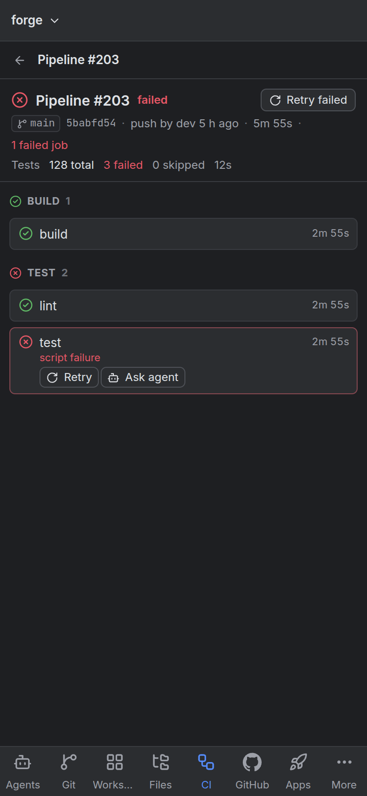

# Your phone and remote access

By default Workbench listens on `127.0.0.1:7777` and only this computer can reach it.
To use it from your phone or another machine, make it reachable, pair the device, and
put TLS in front.

## Make it reachable

Bind it to an address your devices can reach. A [Tailscale](https://tailscale.com)
address is the simplest private option:

```toml
[server]
bind = "100.x.y.z:7777"      # your Tailscale address
```

The local listener on `127.0.0.1` keeps working for your agents and helpers.

## Pair a device

Open **Settings › Remote access** on this computer and scan the QR code with the phone.
The code is valid for ten minutes and signs in one browser. Every device appears in the
list with when it was last seen; **Revoke** signs it out and closes its open connections
at once.

## Put TLS in front

Browsers only give secure pages the features that matter on a phone (push
notifications, the installable app, the clipboard). Pick one:

- `tailscale serve --bg 7777`, which gives you `https://<machine>.<tailnet>.ts.net`.
- Caddy or another reverse proxy with a certificate.
- `[server.tls]` with a certificate and key of your own.

## Install the app and turn on push

On the phone, open Workbench over HTTPS and **Add to Home Screen**. It runs as an app
with tabs for Agents, Git, Workspace, Files, CI, GitHub, Docs, Apps and More.



**Settings › Notifications › Push** (or More on the phone) turns on notifications that
arrive while Workbench is closed:

- an agent that needs you, with **Allow** and **Deny** on the notification when the whole
  request fits in it;
- a finished turn;
- an environment going down, a failed deploy or a failed pipeline.

Notifications travel through the browsers' own push services, end-to-end encrypted,
and carry titles and short summaries only, never code or secrets. On iPhone and iPad,
push works in the Home Screen app (iOS 16.4 or newer).

## Claude Code's Remote Control

Separately from Workbench's own remote access, Claude Code can be switched to Remote
Control per session (the composer's checkbox), or run as a Remote Control server for a
project from the Agents panel. Its claude.ai link is shown on the session.
